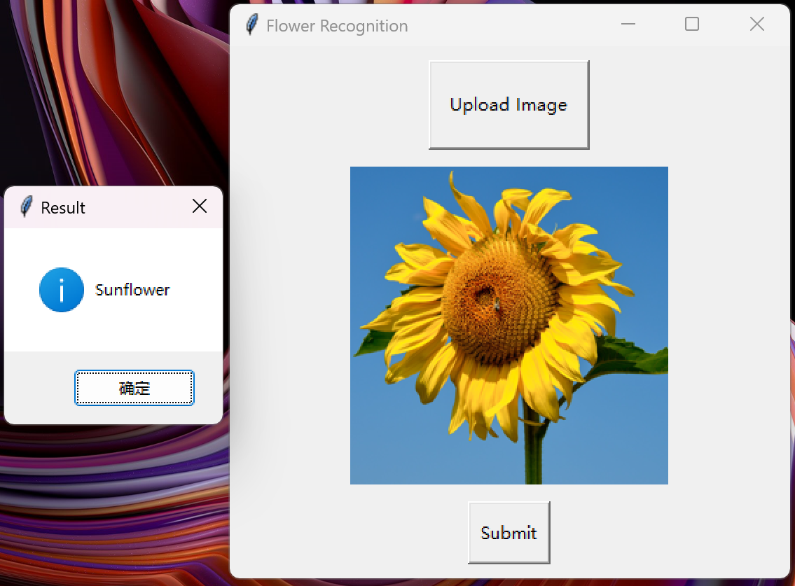

# AlexNet Flower Classification System

English / [中文](readme_zh.md)

↑ 点击切换语言

This project involves training a deep learning model to accurately classify five types of flowers—lily, lotus, sunflower, orchid, and tulip—based on 1,000 images of each type. The model is built on the AlexNet deep convolutional neural network architecture, which gained prominence in the 2012 ILSVRC.



Additionally, a simple GUI interface will be developed using tkinter, as shown above. This interface allows for custom image uploads, with the classification result displayed in a popup window.

## Table of Contents

- [Multilingual Comments](#multilingual-comments)
- [Dataset](#dataset)
- [File Structure](#file-structure)
- [Notice](#notice)
- [Contribution](#contribution)

## Multilingual Comments

To make it easier for developers from different language backgrounds to understand the code, comments in this project are provided in both English and Chinese.

## Dataset

The dataset used in this project is sourced from [Kaggle](https://www.kaggle.com/datasets/kausthubkannan/5-flower-types-classification-dataset).
Please download the dataset directly from the provided link and place it in the data folder.


## File Structure

The project's file structure is as follows:

```c++
FLower_Classification
│
├── data/
│   └── flower_images
│
├── model/
│   ├── flower_model_30.pt
│   └── training.log
│
├── process_data/
│   ├── flower_labels.pkl
│   ├── X_test.pkl
│   ├── X_train.pkl
│   ├── y_test.pkl
│   └── y_train.pkl
│
├── utils(en/zh)/
│   ├── __init__.py
│   ├── data_loader.py
│   ├── data_process.py
│   ├── model.py
│   ├── train.py
│   ├── predict.py
│   ├── predict_upload.py
│   └── GUI.py
│
└── main.py 
```
## Notice

Due to GitHub's file size limit of 25MB, I am unable to upload the dataset and model files directly to this repository. As a result, only the code is available here and I apologize for it.

## Contribution

All forms of contributions are welcome! Whether it's reporting bugs or suggesting new features, Thank you so much!!!
