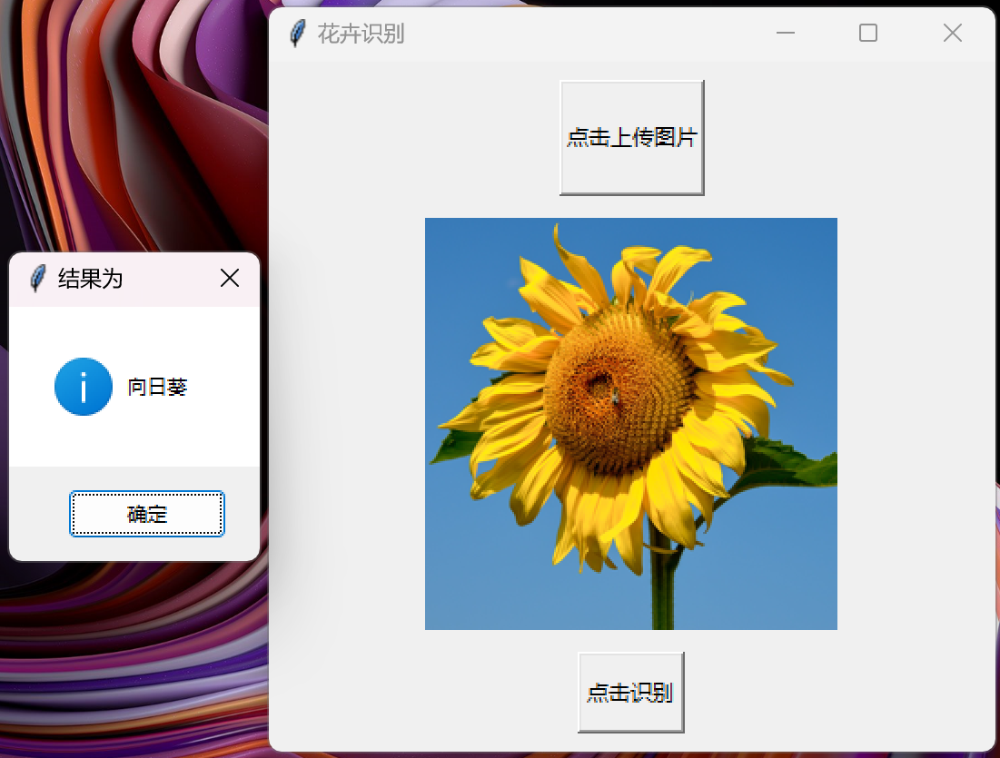

# AlexNet 花卉分类系统

[English](readme.md)  /  中文

↑ Click to switch language

本项目通过对百合 莲花 向日葵 兰花和郁金香五种花卉各一千张照片 基于在2012年ILSVRC中大放异彩的AlexNet的深度卷积神经网络模型进行训练 构建一个能够准确分类这些花卉种类的深度学习模型



并且将会开发一个基于tkinter的简单GUI界面 如上图所示 可以实现自定义图片上传 最后通过一个弹窗得到判断的结果

## 目录

- [多语言注释](#多语言注释)
- [数据集](#数据集)
- [文件结构](#文件结构)
- [注意事项](#注意事项)
- [贡献](#贡献)

## 多语言注释

为了让不同语言背景的开发者更容易理解代码 本项目的注释提供了英文和中文两种版本

## 数据集

本项目使用的数据集来源于[Kaggle](https://www.kaggle.com/datasets/kausthubkannan/5-flower-types-classification-dataset)
请直接从提供的链接下载数据集 并将其放置在data文件夹中

## 文件结构

项目的文件结构如下

```c++
FLower_Classification
│
├── data/
│   └── flower_images
│
├── model/
│   ├── flower_model_30.pt
│   └── training.log
│
├── process_data/
│   ├── flower_labels.pkl
│   ├── X_test.pkl
│   ├── X_train.pkl
│   ├── y_test.pkl
│   └── y_train.pkl
│
├── utils(en/zh)/
│   ├── __init__.py
│   ├── data_loader.py
│   ├── data_process.py
│   ├── model.py
│   ├── train.py
│   ├── predict.py
│   ├── predict_upload.py
│   └── GUI.py
│
└── main.py 

```

## 注意事项

因为GitHub的文件上传最大为25MB 所以我无法将处理后的数据集和模型上传到该项目 所以这里仅提供代码和思路 抱歉

## 贡献

欢迎所有形式的贡献！无论是报告错误还是提出建议 非常感谢！！